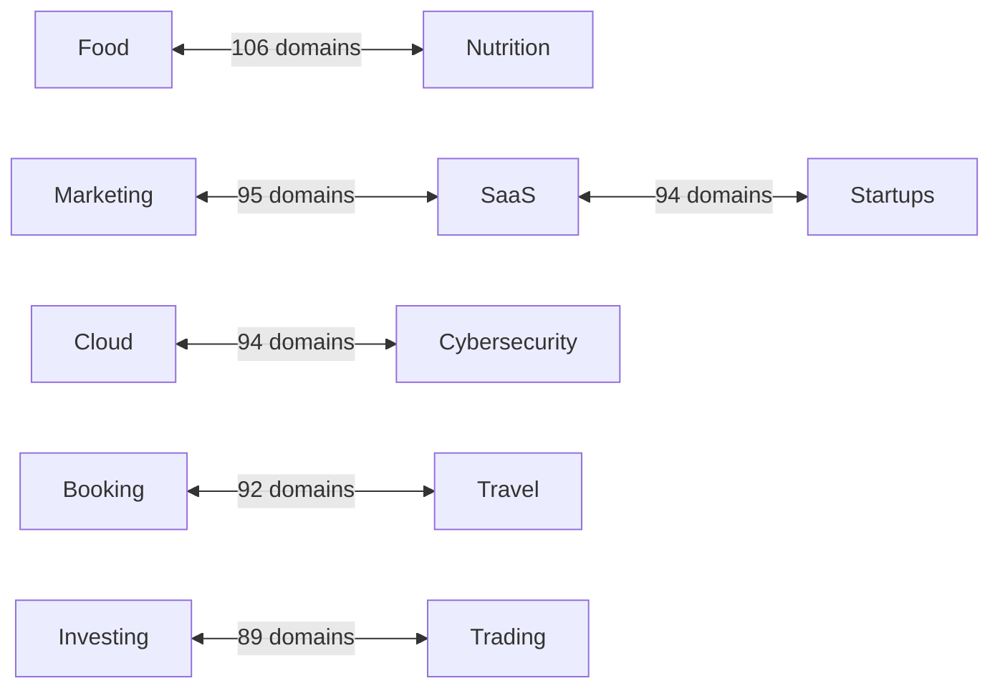

 # The Day We Discovered AI Search Doesn't Care About Your #1 Rankings

> How analyzing 23,936 Perplexity citations completely changed our understanding of search visibility


## Table of Contents

- [The $26 Experiment That Shattered Everything We Knew About SEO](#the-26-experiment-that-shattered-everything-we-knew-about-seo)
- [Why This Research Matters More Than Any Algorithm Update](#why-this-research-matters-more-than-any-algorithm-update)
- [The YouTube Revelation That Changed Everything](#the-youtube-revelation-that-changed-everything)
- [The Cross-Vertical Revolution Nobody Saw Coming](#the-cross-vertical-revolution-nobody-saw-coming)
- [The Hidden Networks: Where Verticals Collide](#the-hidden-networks-where-verticals-collide)
- [The Money Shot: What This Actually Costs](#the-money-shot-what-this-actually-costs)
- [What This Means for Your Business](#what-this-means-for-your-business-the-part-that-should-keep-you-up-at-night)
- [The Uncomfortable Truth About Direct Quotes](#the-uncomfortable-truth-about-direct-quotes)
- [Action Steps: Your 90-Day Authority Building Plan](#action-steps-your-90-day-authority-building-plan)
- [The Future is Already Here](#the-future-is-already-here-its-just-not-evenly-distributed)
- [The Raw Data That Changed Everything](#the-raw-data-that-changed-everything)

---

## The $26 Experiment That Shattered Everything We Knew About SEO

Last month, I spent $26.09 on what might be the most important SEO research of the AI era. 

Not $26,000. Not $2,600. Twenty-six dollars and nine cents.

That modest investment yielded data on 23,936 citations across 6,606 domains—and what we found should terrify anyone still clinging to traditional SEO playbooks.

Here's the punchline: **YouTube gets more AI search citations than Wikipedia, NerdWallet, and the FTC combined.** And that #1 ranking you've been fighting for? It's worth exactly the same as ranking #5.

Welcome to the new rules of search, where everything you know is wrong.


---

## Why This Research Matters More Than Any Algorithm Update

Google updates its algorithm 500-600 times per year. Each update sends the SEO world into a frenzy. But here's what nobody's talking about: 

**AI search isn't iterating on Google's model—it's replacing it entirely.**

When users ask Perplexity a question, they don't see 10 blue links. They see a synthesized answer pulling from multiple sources. And our data shows these AI systems have developed their own rules for determining authority.

### The Scale of Change: By the Numbers

```
Traditional Google Search:
- Position #1: ~31.7% of clicks
- Position #2: ~24.7% of clicks  
- Position #3: ~18.7% of clicks
- Positions #4-10: ~25% combined

AI Search (Perplexity):
- Position #1: 20.15% of citations
- Position #2: 20.15% of citations
- Position #3: 20.14% of citations
- Position #4: 20.08% of citations
- Position #5: 19.48% of citations
```

### 📊 Citation Distribution: The Great Equalizer

#### Traditional SEO (Click Distribution)
```
Position 1  █████████████████████████████████░░░░░░░░░ 31.7%
Position 2  ████████████████████████░░░░░░░░░░░░░░░░░ 24.7%
Position 3  ██████████████████░░░░░░░░░░░░░░░░░░░░░░░ 18.7%
Pos 4-10    █████████████████████████░░░░░░░░░░░░░░░░ 25.0%
```

#### AI Search (Citation Distribution)
```
Position 1  ████████████████████░░░░░░░░░░░░░░░░░░░░░ 20.15%
Position 2  ████████████████████░░░░░░░░░░░░░░░░░░░░░ 20.15%
Position 3  ████████████████████░░░░░░░░░░░░░░░░░░░░░ 20.14%
Position 4  ████████████████████░░░░░░░░░░░░░░░░░░░░░ 20.08%
Position 5  ███████████████████░░░░░░░░░░░░░░░░░░░░░░ 19.48%
```

---

## The YouTube Revelation That Changed Everything

Let me paint you a picture of market dominance:

### 📊 The Citation Giants: A David and Goliath Story

| Rank | Domain | Citations | Visual Representation |
|------|--------|-----------|----------------------|
| 1 | YouTube.com | 1,142 | `████████████████████████████████████████████` |
| 2 | NerdWallet.com | 350 | `██████████████░░░░░░░░░░░░░░░░░░░░░░░░░░░░░` |
| 3 | FTC.gov | 229 | `█████████░░░░░░░░░░░░░░░░░░░░░░░░░░░░░░░░░░` |
| 4 | G2.com | 225 | `█████████░░░░░░░░░░░░░░░░░░░░░░░░░░░░░░░░░░` |
| 5 | NCBI (PMC) | 167 | `██████░░░░░░░░░░░░░░░░░░░░░░░░░░░░░░░░░░░░░` |
| 6 | Shopify.com | 161 | `██████░░░░░░░░░░░░░░░░░░░░░░░░░░░░░░░░░░░░░` |
| 7 | IMDB.com | 147 | `█████░░░░░░░░░░░░░░░░░░░░░░░░░░░░░░░░░░░░░░` |
| 8 | Wikipedia | 144 | `█████░░░░░░░░░░░░░░░░░░░░░░░░░░░░░░░░░░░░░░` |
| 9 | LaunchNotes.com | 137 | `█████░░░░░░░░░░░░░░░░░░░░░░░░░░░░░░░░░░░░░░` |
| 10 | Forbes.com | 130 | `█████░░░░░░░░░░░░░░░░░░░░░░░░░░░░░░░░░░░░░░` |

YouTube doesn't just lead—it dominates with **3.3x more citations** than the second-place domain. But here's where it gets interesting...

### It's Not About Being a Video Platform

YouTube's authority score of 66.941 isn't just about hosting videos. Our analysis revealed YouTube appears in **all 23 verticals** we studied—from Cloud Computing to Mental Health to Investing.

Think about that. A video platform is considered authoritative on:
- Enterprise cloud architecture
- Mental health treatment
- Stock trading strategies
- Cybersecurity best practices

Why? Because YouTube has become humanity's default repository for "how to do anything."

---

## The Cross-Vertical Revolution Nobody Saw Coming

Here's where our jaws hit the floor. We discovered 25 domains that appear in every single vertical we studied. These aren't just popular sites—they're what we call "Universal Authorities."

### 📊 The Authority Multiplier Effect

| Vertical Coverage | Avg Authority Score | Visual Representation |
|-------------------|--------------------|-----------------------|
| 1-3 verticals | 11.2 | `████░░░░░░░░░░░░░░░░░░░░░░░` |
| 4-9 verticals | 18.7 | `████████░░░░░░░░░░░░░░░░░░░` |
| 10-15 verticals | 28.4 | `████████████████░░░░░░░░░░░` |
| 16-22 verticals | 35.6 | `█████████████████████░░░░░░` |
| ALL 23 verticals | 39.2 | `███████████████████████████` |

**📈 Correlation coefficient: 0.381** (strong positive correlation)

### The Universal Authority Club (All 23 Verticals)

| Rank | Domain | Authority Score |
|------|--------|----------------|
| 1 | YouTube.com | 66.9 |
| 2 | Wikipedia.org | 52.1 |
| 3 | UXCam.com | 47.7 |
| 4 | SocialPilot.co | 47.5 |
| 5 | Shopify.com | 46.4 |

Notice something? Except for Wikipedia, these are all commercial platforms that expanded far beyond their original niches.

---

## The Hidden Networks: Where Verticals Collide

We uncovered fascinating patterns in how different verticals share domain authorities:

### 📊 Top Vertical Overlaps (Shared Domains)



| Vertical Pair | Shared Domains | Overlap Strength |
|---------------|----------------|------------------|
| Food ↔ Nutrition | 106 | `████████████████████████` |
| Marketing ↔ SaaS | 95 | `██████████████████████` |
| Cloud ↔ Cybersecurity | 94 | `██████████████████████` |
| SaaS ↔ Startups | 94 | `██████████████████████` |
| Booking ↔ Travel | 92 | `█████████████████████` |
| Investing ↔ Trading | 89 | `████████████████████` |

These overlaps aren't random—they're strategic goldmines. If you're strong in Food content, you have a natural bridge to Nutrition. If you dominate SaaS, Marketing is your next frontier.

---

## The Money Shot: What This Actually Costs

Remember that $26.09 I mentioned? Here's what it bought us:

### 📊 Cost Efficiency Analysis

| Query Type | Citations per Dollar | Efficiency Rating |
|------------|---------------------|-------------------|
| How-to | 186.26 | `████████████████████████████` |
| Review | 185.74 | `████████████████████████████` |
| Best | 183.46 | `███████████████████████████` |
| Guide | 181.14 | `███████████████████████████` |
| Comparison | 181.89 | `███████████████████████████` |

### 💡 Key Insights

- **Query complexity has almost ZERO impact on cost**
  - Simple queries: $0.0054 average
  - Complex queries: $0.0054 average
  - Success rate: 100% across all types

This consistency tells us something crucial: AI search has reached operational maturity. It's not experimental anymore—it's optimized, efficient, and scalable.

---

## What This Means for Your Business (The Part That Should Keep You Up at Night)

### If You're in SEO:

#### The Old Playbook is Dead:
- ❌ Fighting for position #1? You're wasting resources
- ❌ Building links in one niche? You're thinking too small
- ❌ Ignoring video content? You're invisible to AI

#### The New Playbook:
1. ✅ **Go Wide, Not Just Deep**: Expand into adjacent verticals strategically
2. ✅ **Create Synthesis-Friendly Content**: Write for AI extraction, not just human readers
3. ✅ **Build Temporal Consistency**: Regular updates > viral hits

### If You're a Business Owner:

**Your Competitors Are Already Moving:**
While you're fighting for Google rankings, smart companies are building cross-vertical authority. They're not trying to rank #1—they're trying to be cited everywhere.

### 📊 The Authority Building Roadmap

| Authority Level | Score Range | Percentile | Your Status |
|-----------------|-------------|------------|-------------|
| **Below Median** | < 10.6 | Bottom 50% | WHERE YOU PROBABLY ARE |
| **Solid Authority** | 10.6-25.6 | 50th-90th | WHERE YOU NEED TO BE |
| **Strong Authority** | 25.6-40 | 90th-99th | WHERE THE WINNERS ARE |
| **Market Leaders** | 40+ | Top 1% | WHERE THE GIANTS LIVE |

```
Below Median    ████░░░░░░░░░░░░░░░░░░ 50% of domains
Solid Authority ████████████░░░░░░░░░ 40% of domains
Strong Authority ████████████████████░░ 9% of domains
Market Leaders  ██████████████████████ 1% of domains
```

---

## The Uncomfortable Truth About Direct Quotes

One of our most surprising findings: Only 5% of citations include direct quotes. The rest? AI is synthesizing, summarizing, and recontextualizing your content.

**What This Means:**
- ❌ Your perfectly crafted sentences? They're being rewritten
- ❌ Your careful keyword placement? Irrelevant
- ❌ Your brand voice? Lost in translation

The winners are creating content so fundamentally useful that it survives the synthesis process.

---

## Action Steps: Your 90-Day Authority Building Plan

### Month 1: Foundation
- [ ] **Audit Your Cross-Vertical Potential**
  - Map your current content to our 23 verticals
  - Identify 3-5 natural expansion opportunities
  - Look for high-overlap vertical pairs

- [ ] **YouTube or Die**
  - Start a YouTube channel yesterday
  - Create video versions of your top content
  - Add transcripts to everything

### Month 2: Expansion
- [ ] **Launch Cross-Vertical Content Hubs**
  - Create bridge content between verticals
  - Develop "universal" resources cited across contexts
  - Focus on synthesis-friendly formats

- [ ] **Optimize for AI Extraction**
  - Clear, declarative statements
  - Structured data markup
  - Fact-rich, opinion-light content

### Month 3: Scale
- [ ] **Build Temporal Consistency**
  - Regular publishing schedule
  - Content refresh calendar
  - Consistent cross-vertical presence

- [ ] **Measure What Matters**
  - Track citations, not just rankings
  - Monitor cross-vertical presence
  - Calculate your authority score

---

## The Future is Already Here (It's Just Not Evenly Distributed)

William Gibson was right about the future. And right now, the future of search is being written by AI systems that don't care about your backlinks, your domain authority, or your perfect keyword density.

They care about one thing: **Can you provide useful information across multiple contexts?**

The 25 domains that cracked this code aren't smarter than you. They just understood the game changed before you did.

Now you know. The question is: What are you going to do about it?

---

## The Raw Data That Changed Everything

### Study Specifications

| Metric | Value |
|--------|-------|
| Domains analyzed | 6,606 |
| Total citations tracked | 23,936 |
| Queries executed | 4,835 |
| Verticals covered | 23 |
| Query success rate | 100% |
| Average cost per query | $0.0054 |
| Total investment | $26.09 |

### Dataset Components

- ✅ Domain-by-domain authority scores
- ✅ Complete citation patterns
- ✅ Cross-vertical mapping
- ✅ Query performance metrics
- ✅ Cost efficiency analysis

### Want the Full Dataset?

We're making our complete findings available to the research community. 

📊 **[Download the complete dataset and methodology](https://github.com/yourusername/perplexity-authority-mapping)**

---

## Final Thought: The $26 Million Dollar Question

We spent $26 to uncover insights that could be worth millions to the right company. Because understanding how AI search works today is like having tomorrow's newspaper.

The companies that adapt to these new rules won't just survive the AI transition—they'll dominate it.

The rest? They'll wonder why their perfect SEO scores stopped mattering.

Welcome to the new game. The rules have changed. And now, finally, you know what they are.

---

### Citation

If you found this research valuable, please cite:

```bibtex
@article{perplexity_authority_2025,
  title={The Day We Discovered AI Search Doesn't Care About Your #1 Rankings},
  author={Jeremy Meindl},
  year={2025},
  month={August},
  url={https://github.com/HuestonCo/perplexity-citations-study}
}
```

### Connect
- 💼 LinkedIn: [Jeremy Meindl ](https://www.linkedin.com/in/jeremymeindl/)
- 💼 LinkedIn: [Robin Adams ](https://www.linkedin.com/in/robin-adams-buffalo-seo/)
- 🐦 Hueston LLMO: https://hueston.co 


### License

This research is published under [MIT License](LICENSE.md).

---

**Keywords:** `AI search optimization` `Perplexity SEO` `cross-vertical content strategy` `YouTube SEO dominance` `AI citation analysis` `future of search`
